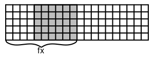

#Case configuration

All case properties(geometry,BCs,model settings, etc.) are specified within XML files. Generally, the structure of the file should look like that:
```xml
<?xml version="1.0"?>
<CLBConfig>
        <Units>
              <Params/> <!-- Specify relation between LB and real world units here -->
        </Units>
        <Geometry>  <!-- Domain size --> 
              <!-- Collision type, boundary conditions, creating/importing objects -->
        </Geometry>
        <Model>
              <Params/> <!-- All parameters like velocity, density, viscosity -->
        </Model>
        <!-- Callbacks, python/r code -->
</CLBConfig>
```
Working example with some sample values is shown below, along with explanation of each lines functionality.

```xml
<?xml version="1.0"?>
<CLBConfig version="2.0" output="output/test">
        <Geometry nx="1024" ny="100">
                <MRT><Box/></MRT>
                <WVelocity name="Inlet"><Box nx="1"/></WVelocity>
                <EPressure><Box dx="-1"/></EPressure>
                <Wall mask = "ALL">
                        <Box ny="1"/>
                        <Box dy="-1"/>
                </Wall>
        </Geometry>
        <Model>
                <Params Velocity-Inlet="0.01"/>
                <Params nu="0.05"/>
        </Model>
        <Solve Iterations="5000"/>
        <VTK Iterations="50" what = "U,P"/>
        <Solve Iterations="1000"/>
</CLBConfig>

```
Element                                         | Functionality
------------------------------------------      | ---------------------------------------------------------------------------------
`<?xml version="1.0"?>`                         | Header required for all case files.
`<CLBConfig output="output/test">`              | All configuration settings must be contained within this element, additionally it is possible to specify deisred output path and/or filename prefix here. In example all files will be saved in `~TCLB/output` folder, with all the filenames begining with `test` prefix.
`<Geometry nx="1024" ny="100">`                 | Element containing all informations regarding geometry(domain size/shape, whats insinde domain). `nx="1024"" ny="100"` specifies a domain containing 1024 elements in x-direction and 100 in y-direction. TODO: specyfikacja nx,dx,fx etc.
`<MRT><Box/></MRT>`                             | `MRT` is 
`<WVelocity name="Inlet"><Box nx="1"/></WVelocity>`   |Creates velocity inlet at western side of the domain(TODO: Orientation), with width equal to 1 element and assignes it name `Inlet`(usefull for specifying zonal parameters later on).
`<EPressure><Box dx="-1"/></EPressure>`           | Creates pressure outlet at eastern side of the domain, with width equal to to 1 element.
`<Wall mask = "ALL">` <br> `<Box ny="1"/>` <br> `<Box dy="-1"/>` <br> `</Wall>`  | Creates `wall` elements. `mask="ALL"` tells us that all types(also from other groups) will be overwritten by `wall` element type, e.g the collision enabled in `<MRT><Box/></MRT>` will be disabled.
`</Geometry>`                                   | Closing tag for `<Geometry>` element.
`<Model>`                                       | Element containing all desired model settings(`Params`)
`<Params Velocity-Inlet="0.01"/>`               | Setting the value of `Velocity` parameter to 0.01 in `Inlet` element(specified in Geometry).
`<Params nu="0.05"/>`                           | Setting the value of `nu` parametere to `0.05`.
`</Model>`                                      | Closing tag for `<Model>` element. The case is initialized after this tag.
`<Solve Iterations="5000"/>`                    | Runs 5000 iterations
`<VTK Iterations="50"/>`                        | Specifies that next `<Solve>` element will create an VTK output file every 50 iterations, saving there U and P quantities. By default everything is saved, creating rather large file for bigger cases.
`<Solve Iterations="1000"/>`                    | Runs 1000 iterations, creating `VTK` output every 50 iterations, as specified earlier.
`</CLBConfig>`                                  | Closing tag for `<CLBConfig>` element, finishing whole case file.

All case files start with `<?xml version="1.0"?>` header.

The configuration must be in the `<CLBConfig>` element(`<CLBConfig/>` at start and `</CLBConfig>` at the end). In this element the output path and/or prefix can be specified. In example above all files will be saved in `~TCLB/output` folder, with all the filenames begining with `test` prefix.

`<Geometry>` element contains the definition of the domain and objects within it


##Geometry definition 

It's easy to imagine how the geometry elements are defined, by thinking about it as "painting". Each geometry element must have 2 parameters "what are we painting with" and "where are we painting":
```xml
<Wall mask="ALL">
  <Box dx="4" nx="10" ny="30"/>
</Wall>
```

In this example "what" is `Wall` element and "where" is `<Box dx="4" nx="10" ny="30"/>`. Defining "where" can be done in multiple ways, using `nx`,`dx`,`fx` arguments(similarly for `y` and `z`). To understand the geometry definition, you have to know that `box` element by default spans the whole available space. Then by imposing `dx`, `nx` and `fx` attributes you cut it smaller. `dx` sets where the box starts, `nx` sets how *long* is the box in the x direction, and `fx` sets where it ends. Additionally, if you set a negative value it means a value *from the end*. The same applies of course to `y` and `z`. For example:

Element | Region
------- | ------------------------------------------
`<Box nx="1"/>` | Left border of the domain
`<Box dx="-1"/>` | Right border of the domain
`<Box dx="10"/>` | Everything starting from the 11th element (in x direction)
`<Box dx="-10"/>` | 10 last layers in the x direction
`<Box nx="10" ny="10"/>` | Square 10x10 in the left bottom corner

Geometry constrain            | XML Element
----------------------------- | ------------------
  | `<Box dx="4"/>`
 | `<Box dx="-4"/>`
  | `<Box dx="4" nx="10"/>`
  | `<Box dx="4" fx="10"/>`

###Possible geometry primitives

`Box` Creates a box with corners defined by `nx`/`dx`/`fx` etc. parameters.

`Wedge` Creates a wedge within a `box`, additionally `direction` must be specified ("LowerRight", "LowerLeft", "UpperRight", "UpperLeft") e.g: `<Wedge dx="4" fx="10" dy="1" ny="10" direction="LowerRight"/>`

`Sphere` Creates a sphere within a `box`, can have different dimensions in x/y/z.

##Node Types

Node type consists of several properties, which are organized in groups. Each node can have noly one property from each group. Additional groups can be


