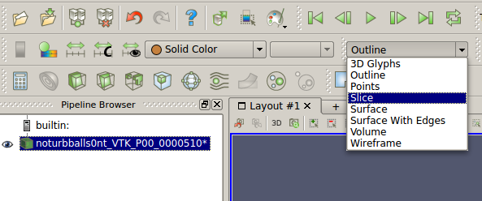
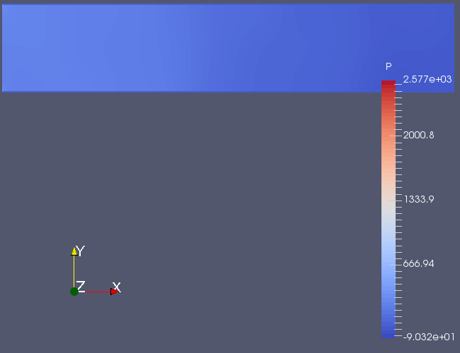
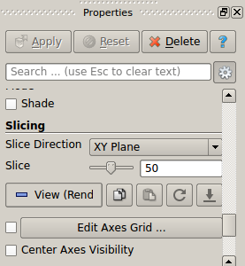
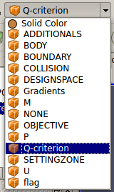
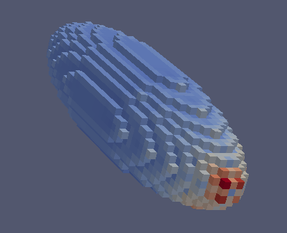
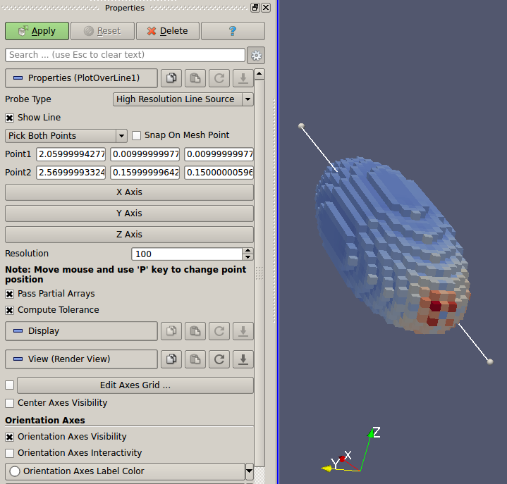
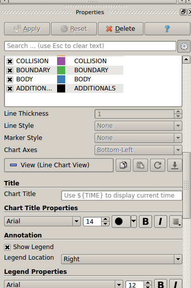
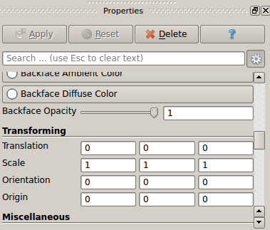

Results of the calculations can be analyzed using [ParaView](https://www.paraview.org/), an open-source, multi-platform data analysis and visualization application. It can be easily installed by running 
```bash
sudo apt-get install paraview
```
Or, if you want to install newer version, it can be downloaded [here](https://www.paraview.org/download/).

Paraview can open most of the files generated by the TCLB solver(`.pvti`,`.csv`) or required to run calculations(`.stl`). 

File extension  | Comment
-------------   | ------------------------------------------------------------------------------------------
`.vti`          | VTK files generated by the `<VTK>` callback in `.xml` case files. Each solver thread creates its own `.vti` file when saving them. That's why (usually) you do not want to open files with this extension.
*`.pvti`*     | Files linking separate `.vti` files, opening them will allow navigation through whole domain/time.
`.csv`          | Log files generated by the `<Log>` callback in `.xml` case files. Containing all the values of Settings and Globals defined in [`Dynamics.R`](/5.-Model-development/basics).
`.xml`          | Configuration files, containing `.xml` case file and information about code version/compilation settings.
`.stl`          | Geometry files.


##Loading file

ParaView can be started either from the start menu or the terminal. When using the latter it is possible to specify which file should be opened:

```bash
paraview output/d2q9_poiseuille_VTK_P00_..pvti
```

File(s) can be opened by right clicking on icon in the left-top corner or using `ctrl+o`, to choose multiple files hold `ctrl` while picking. After chosing the file, click `Apply` in the properties menu to load it. It is possible to chose at this point which data to load, which is especially usefull when analysing bigger cases. 

<center>  </center>

Note: What is displayed here depends on what is defined in Dynamics.R


##Changing display options

After loading file you will see only the outline of the domain, as this is the default display option and default displayed data is 'Solid Color'. You can change it by choosing another option from the list.Let's try viewing pressure in the middle of the domain - to do this we need to switch display option to `Slice` and displayed data to `P`. (see images below)

<center>  </center>

<center>  </center>

After that it should look like this:
<center>  </center>

Notice how the presented colours are only on the one side of the spectrum. Spectrum can be rescaled either automatically to data range, or by manually providing the values.

<center>  </center> 

It is possible that sometimes the automatic rescaling is not working as expected, it is usually caused by elements inside/near inlet/outlet which have  enourmously high/low values. The same case after rescaling:

<center>  </center>

Using the `Slice` display option we can choose where to slice in the `Properties` menu:

<center>  </center>


## Q-Criterion

Find `Gradient Of Unstructured DataSet` in `Filters` menu( or use built in search function - `ctrl+spacebar`). Chose velocity array(`U`) as `Scalar Array` in `Properties` menu and mark the box labeled `Compute QCriterion`. You will now be able to display calculated `Q-criterion` by switching displayed array.
<center>    </center>

##Threshold 

Find (`ctrl+spacebar`) `Threshold` function, then pick which values will be checked. For example, to separate studied object from the rest of the flow pick `BOUNDARY`(it's equal to 1 for `Wall` nodes and 0 for flow nodes). 

<center>    </center>

If you want to get rid of the walls you can use `Extract  Subset` filter to pick a portion of domain without walls and apply threshold later.

<center>  </center>

##Plot Over line

After picking `Plot Over Line` filter you can either specify the end points in `Properties` menu or manipulute them using mouse. 

<center>  </center>

After clicking `Apply` a new window will open with the plot. You can choose wchich variables to use in `Properties` menu(along other options).

<center>  </center>

##Viewing STL geometry

You can use ParaView to view `.stl` files. This comes in handy when  you need to import `.stl` geometry in your case, but don't know which parameters to use. By loading `.stl` along with you generated domain(in `.pvti` file) `.stl` geometry can be quickly fitted to your domain. For this purpose use `Transforming` in `Properties` menu. The same values should work while loading `.stl` in `.xml` file.

<center>  </center>


