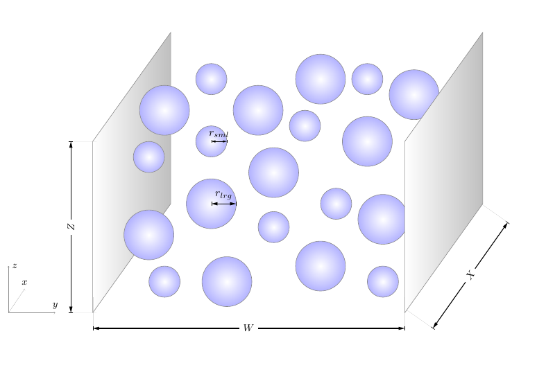
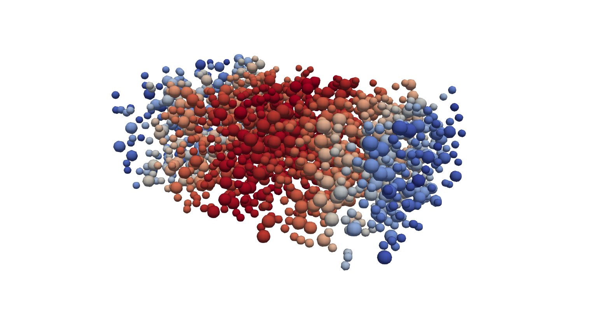

# Simulating Particles with LIGGGHTS

This tutorial will show you how to set up a simple LBM-DEM simulation, as a starting point for your own, more complex particulate flow simulations.

## Case

The case of particles flowing in a planar channel is fundamental to the study of granular flows. It is easily simulated with LBM by bounding the flow with walls in the transverse direction only, and allowing the flow and vertical directions to be periodic. In this way a relatively small computational domain can be used to simulate large length scales.



Here we will simulate a bidisperse suspension (i.e., containing particles of two different sizes) at a relatively low solid volume fraction of 0.1. The particles will initially be randomly dispersed throughout the domain, and then driven by the force applied to the flow.

## Installing and compiling

Before beginning, we will need to install LIGGGHTS and then compile TCLB with LIGGGHTS.

### LIGGGHTS installation

!!! note
	These instructions should be sufficient for installation of LIGGGHTS for use with TCLB. For full installation details please refer to the [LIGGGHTS documentation](https://www.cfdem.com/media/DEM/docu/Section_start.html).

```bash
git clone https://github.com/CFDEMproject/LIGGGHTS-PUBLIC.git
cd LIGGGHTS-PUBLIC/src
make auto
```

This will throw an error the first time it is run, which is normal. Next switch off two of the default compilation settings in `MAKE/Makefile.user`:

```bash
# VTK: "ON" or "OFF"
# Description: Allow the use of VTK output that can be read directly with ParaView
USE_VTK = "OFF"

...

# SUPERQUADRICS: "ON" or "OFF"
# Description: Enable superquadric particles (Note: requires boost)
USE_SUPERQUADRICS = "OFF"
```

Now build LIGGGHTS as a shared library:

```bash
make clean-all
make makeshlib
make -f Makefile.shlib auto -j8
```

### TCLB configuration

!!! note "Compilation"
	For instructions on how to compile and run TCLB please refer to the
	[Getting Started guide](/1.-Getting-started/installation/)

To configure TCLB to run with LIGGHTS, we simply add an additional option to the configuration:

```bash
./configure --with-lammps=/<path to LIGGGHTS directory>/LIGGGHTS-PUBLIC/
```

Any desired model can be developed in TCLB for particle simulations, however currently the only particle model with full physics which comes ready-coded is the Partially Saturated Method ([Noble & Torczynski, 1998](https://doi.org/10.1142/S0129183198001084)). To compile (with the non-equilibrium bounce-back solid collision operator):

```bash
make -j8 d3q27_PSM_NEBB
```

## LIGGGHTS script

TCLB is configured to be run with a separate LIGGGHTS input script. These LIGGGHTS scripts are typically prefixed by the `in.` file extension. First create an input script called `in.channel-particles`

Scripts are generally formatted with 'commands' and 'fixes', which contain the fix or command name followed by keywords and values, all separated by spaces.

!!! note
    For more information on any of the following commands, or to search the many additional commands which are possible, refer to the [LIGGGHTS documentation](https://www.cfdem.com/media/DEM/docu/Section_commands.html)

The first part of the script contains the initialisation:

```bash
# Initialisation
units       cgs
boundary    p p f
newton      off
atom_style  sphere
atom_modify map array
communicate single vel yes
processors  1 1 1
```

Setting the `units` command to `cgs` defines the DEM units for length-mass-time to be in centimetres-grams-seconds (refer to [units documentation](https://www.cfdem.com/media/DEM/docu/units.html) for full details). This is required in simulations of micron-sized particles (which is very frequent!) in order to keep the time step small and maintain the computation precision, among other things. 

`boundary` `p p f` makes the DEM simulation periodic in the x and y directions and non-periodic ('fixed') in the z direction.

`newton` must be set to `off` in order to calculate tangential forces (i.e. friction).

`atom_modify` defines how particles are stored in memory and how frequently sorting occurs, but `map array` generally gives the best performance for our purposes. The same is true for the `communicate` settings, which define how particle data is passed between processors.

Finally, the `processors` command defines the number of processors as domain subdivisions in each direction. E.g., `2 2 1` would result in 4 total CPUs being used for the DEM simulation.

Next we define how the list of neighbour particles are built:

```bash
neighbor        0.8e-4 bin
neigh_modify    delay 0
```

If particles are within the skin distance (`0.8e-4` here), they will be stored as neighbours. The skin distance is particularly important for particles of multiple sizes, and must be greater than `d_lrg - r_lrg - r_sml` (diameter of largest particle, radius of largest particle, radius of smallest particle) to ensure that particle contacts are correctly captured. Setting `neigh_modify` to `delay 0` rebuilds the neighbour list every step, and is generally okay for performance.

Next we define the simulation domain:

```bash
# Declare domain
region      domain block 0.0 64.0e-4 0.0 40.0e-4 0.0 101e-4
create_box  2 domain
```

where `create_box  2 domain` specifies that we want 2 different particle/wall types, which can be set with different properties if desired, and which we can specify into groups for later settings:

```bash
# Specify particle groups
group  particle_group type 1
group  wall_group type 2
```

Next we define the particle insertions:

```bash
# Define region for particle insertion
region  pack block 0.0 64.0e-4 0.0 40.0e-4 0.5e-4 100.5e-4
# Define particle templates to be used in distribution
fix     part_1 particle_group particletemplate/sphere 17891 atom_type 1 density constant 2 radius constant 1.3e-4
fix     part_2 particle_group particletemplate/sphere 17903 atom_type 1 density constant 2 radius constant 2e-4
# Define distribution for insertion
fix     dist particle_group particledistribution/discrete 18143 2 part_1 0.4 part_2 0.6
# Insert particles
fix     ins particle_group insert/pack seed 100003 distributiontemplate dist maxattempt 1000 insert_every once overlapcheck yes all_in yes region pack volumefraction_region 0.1
```

The `particledistribution/discrete` command inserts each particle template as a volume fraction of the total particle volume, whereas `particledistribution/discrete/numberbased` uses the number fraction of particles instead.

Next the particle/wall material properties are defined:

```bash
# Define material properties
soft_particles yes
fix m1 all property/global youngsModulus peratomtype 5e4 5e4
fix m2 all property/global poissonsRatio peratomtype 0.5 0.5
fix m3 all property/global coefficientRestitution peratomtypepair 2 0.8 0.8 0.8 0.8
fix m4 all property/global coefficientFriction peratomtypepair 2 0.5 0.7 0.7 0.7
```

The two values for `youngsModulus` and `poissonsRatio` define those properties for each particle type, while for `coefficientRestitution` and `coefficientFriction` the interactions between `n` dfferent particle types must be represented by a symmetric `n x n` matrix. For example, here we have defined the 1,1 element of the friction matrix to be 0.5, meaning that all particles will interact with a friction coefficient of 0.5, while setting the 1,2 and 2,1 elements to 0.7 means that the particles and walls will interact with a friction coeffciient of 0.7. The 2,2 element is essentially redundant, seeing as walls won't be interacting.

The non-linear Hertz contact model provides a good reproduction of granular suspension physics:

```bash
# Define physics for contacts
pair_style  gran model hertz tangential history
pair_coeff  * *
```

With this model, the material properties defined earlier effectively define the elastic and damping coefficients (refer to the [Hertz model documentation](https://www.cfdem.com/media/DEM/docu/gran_model_hertz.html) for full details). The `tangential history` option switches the calculation of tangential forces on, which emulates friction. `pair_coeff  * *` simply states that the Hertz contant model should be appled to the interactions of all types, however this can be modified if desired.

Planar walls are simply defined with:

```bash
# Define walls and wall physics
fix wall1 all wall/gran model hertz tangential history primitive type 1 zplane 0.5e-4
fix wall2 all wall/gran model hertz tangential history primitive type 1 zplane 100.5e-4
```

Here the contact model should match the one defined earlier. In this case, we place the DEM walls at one LBM lattice spacing within the domain, so that they line up with the bounce-back boundaries in the LBM simulation.

We then define the integration, timestep and coupling to TCLB:

```bash
# Apply integration
fix integr particle_group nve/sphere
# Couple to TCLB
fix     tclb all external pf/callback 1 1
timestep 4.167e-8
```

where the first number of `fix tclb` defines the number of DEM substeps performed for each LBM timestep. If this is changed from 1 then the DEM timestep should also be modified accordingly.

Finally we specify the DEM data to write to output files every 1000 steps and set the total simulation time:

```bash
dump    dmp all custom 1000 output/particles_in_channel/particles_* id type x y z vx vy vz omegax omegay omegaz radius density
run 100000 upto
```

If desired, numerous different run commands exist and can be used to perform various tasks, for example, modify fixed flags and commands at certain points during a simulation.


## TCLB script

Next we will set up the TCLB input script. For full details of settling up TCLB simulations see [Case Basics](/3.-Running-simulations/case-basics.md').

First create an input script called `channel-particles.xml`. After declaring the output directory,

```xml
<?xml version="1.0"?>
<CLBConfig version="2.0" output="output/particles_in_channel/">
```

For convenience of aligning the DEM and LBM simulations, we will make use of the units feature. This allows us to work in physical (as opposed to lattice) units and makes coupling to the LIGGGHTS simulation a bit more straightforward and intuitive:

```xml
    <Units>
        <Param value="0.5e-4m" gauge="1"/>
        <Param value="4.167e-8s" gauge="1"/>
        <Param value="1kg/m3" gauge="1"/>
    </Units>
```

In this way we can interpret `m` as representing `cm` and `kg/m3` as representing `g/cm3`, to align with the DEM units (the size of one LB cell is therefore equal to `0.5e-4 cm`, one time step is equal to `4.167e-8 s`, and the fluid density is `1 g/cm3`). With a relaxation rate of 1, this physical lattice spacing and time step equates to a physical kinematic viscosity of `0.01 cm2/s`, equivalent to that of water. The parameters here create quite an involved scenario that would require approximately 30-45 minutes to compute on a good GPU. If you are simply running this as a tutorial to practice, and don't want to wait this long to obtain some Colourful Fluid Dynamics, set the spatial gauge to 0.25 and the temporal gauge to 0.0625. This will keep the physical viscosity constant, seeing as we specify the relaxation time later.

Note that increasing the physical lattice spacing in this way will shift the LBM walls inwards (also decreasing the effective channel width if the width of the computational domain is kept constant). Accordingly, the positions of the two walls in the LIGGGHTS simulation must be changed to 2e-4 and 99e-4, respectively, and the z-lo and z-hi values of the injection region must also be changed to 2e-4 and 99e-4, respectively. Furthermore, the time step in the LIGGGHTS simulation must be increased by a factor of 16, to 6.6672e-7, which means that the dump frequency should be decreased to approximately 50, and the total simulation time (in both TCLB and LIGGGHTS) should be decreased to around 6000.

Next we define the simulation domain and the bounding walls:

```xml
    <Geometry nx="64e-4m" ny="40e-4m" nz="101e-4m">
        <BGK><Box/></BGK>
        <Wall mask="ALL">
            <Box dz="-1"/>
            <Box nz="1"/>
        </Wall>
    </Geometry>
```

and the model parameters and coupling to LIGGGHTS:

```xml
    <Model>
        <Param name="omegaF" value="1.0"/>
        <Param name="AccelX" value="10000m/s2"/>
        <RemoteForceInterface integrator="LAMMPS"/>
    </Model>
```

where `omegaF` is equal to 1 over the relaxation rate.

Finally we choose to output the fluid velocity, boundaries and Solid (which is an additional quantitiy output for the `d3q27_PSM` model) in VTK format for the initial time step. If desired we can do this at regular intervals, however for particle simulations it is generally sufficient to visualise the particle data only (which are much less memory intensive than VTK files) as will be seen later. Here we also specify the total time for which the simulation is run:

```xml
    <VTK what="U,BOUNDARY,Solid"/>
    <Log Iterations="1000"/>
    <Solve Iterations="100000"/>
</CLBConfig>
```

## Running the simulation

The TCLB and LIGGGHTS scripts are executed at the same time and run as separate simulations on GPU (if configured as such) and CPU, respectively, with data communicated between them at each time step. This can be done via the Multiple Program Multiple Data (MPMD) approach:

```bash
mpirun -np 1 CLB/d3q27_PSM_NEBB/main channel-particles.xml : -np 1 CLB/d3q27_PSM_NEBB/lammps in.channel-particles
``` 

### Results

LIGGGHTS outputs the particle data in text files, which can be efficiently parsed for post-processing purposes, but must be converted to VTK format to be visualised. To do so we used the 'Pizza.py` post processing tool. To install:

```bash
git clone https://github.com/CFDEMproject/LPP.git
cd LPP
sudo mkdir /opt/LPP/
sudo ./install.sh -p /opt/LPP/
```

Then to run, navigate to the directory containing the output text files, and execute:

```bash
python2 /opt/LPP/lpp particles_* --chunksize 1 --cpunum 4
```

This command can be run during the simulation to inspect intermediate results. Loading the resulting .vtk files into paraview and selecting the appropriate glyph and colouring by velocity, the result should look like the image below. Note, that when you create the glyph element, you need to select it to be a sphere, set the Radius to 1 and the scale on the radius to be 1. 



